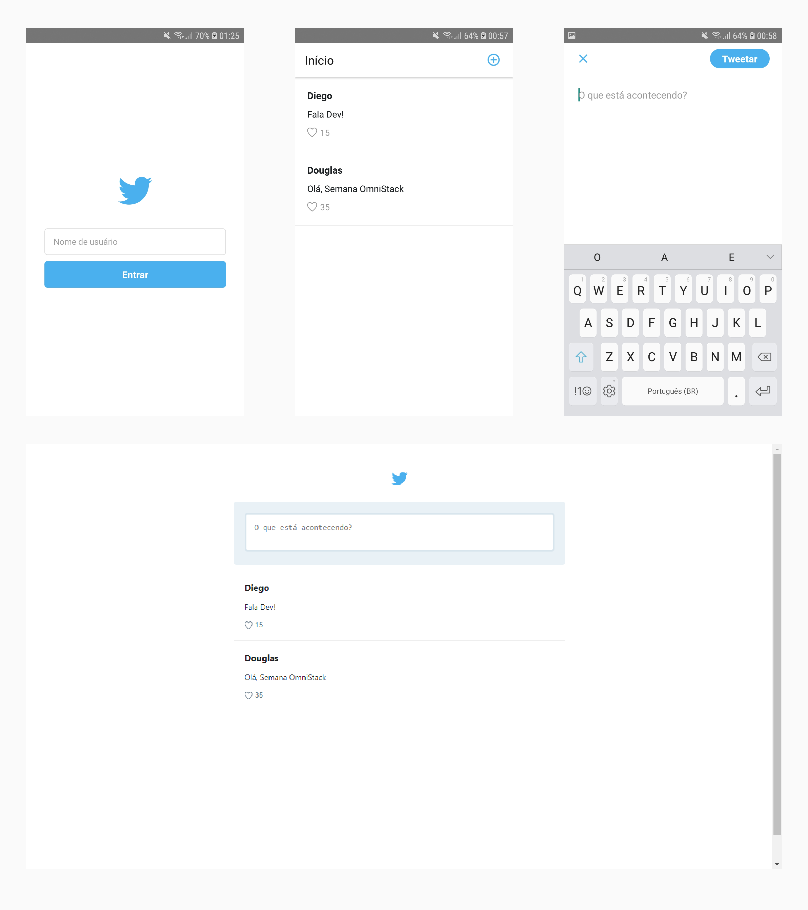

<h1 align="center">Semana Omnistack 5</h1>

Projeto desenvolvido na semana OmniStack 5.0 da Rocketseat.

## Sobre o projeto

A ideia do projeto é criar um aplicativo semelhante ao do Twitter, usando a stack Node.js, ReactJS e React Native.

## Funcionalidades

- Criação de Tweets
- Listar todos os Tweets
- Tweets podem receber Likes
- Tweets e Likes atualizam em tempo real

  

## Backend

Para executar o backend siga as instruções do arquivo [README.md](https://github.com/DouglasVarollo/OmniStack5/blob/master/backend/README.md) que está na pasta backend.

## Frontend

Para executar o frontend siga as instruções do arquivo [README.md](https://github.com/DouglasVarollo/OmniStack5/blob/master/frontend/README.md) que está na pasta frontend.

## Mobile

Para executar o mobile siga as instruções do arquivo [README.md](https://github.com/DouglasVarollo/OmniStack5/blob/master/mobile/README.md) que está na pasta mobile.

